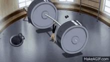
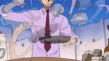
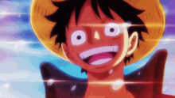
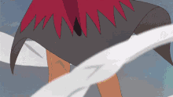

## Hey there I am Pranav,

### My Work Experience
#### Co-founder and CTO @ https://www.blueprint.io/

#### Software Engineering Intern @ Rivian Automotive (September 2024-December 2024)

#### Software Engineering Intern @ Rivian Automotive (May 2024-August 2024)

#### Software Systems Engineering Intern @ Qualcomm Incorperated (May 2023-August 2023)

---

### Outside the code

A few favorites, and what I love about them.

#### Pokémon

Chimchar and Charmander’s stories—from being written off to becoming two of Ash’s aces. Those arcs have always stuck with me.

  
  

#### One Piece

Zoro’s work ethic. Sanji’s passion and compassion. Luffy’s leadership and belief in himself.

  
  
  

#### Naruto

Just badass.

GIFs link to their sources on Tenor.
